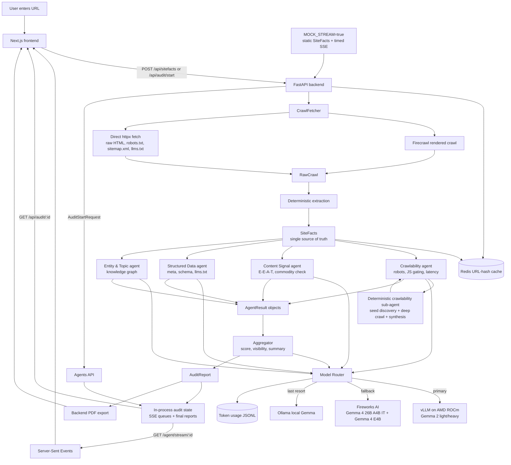
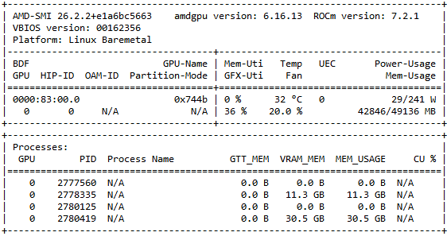
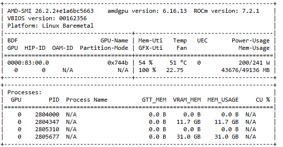

# Findable

> Can AI actually read, trust, and cite your website?

Findable audits a URL the way AI crawlers and answer engines see it. It shows what content is JS-gated, which AI bots are blocked, whether the page exposes clean facts and schema, and whether the content is trustworthy enough to be cited by ChatGPT, Claude, Perplexity, Gemini, and Google AI Overviews.

**Built by Team Dhridhata** - Aaditya Acharya, Rohith Neeraje

---

## Why Findable

Classic SEO tells you whether a page can rank in search results. Findable answers a newer question: can an AI system crawl the page, understand the facts, trust the source, and cite it in an answer?

A page can look perfect in a browser and still be invisible or weak for AI because:

- the main content only appears after JavaScript runs,
- `robots.txt` blocks AI crawlers,
- metadata or schema is missing,
- there is no clear authorship, citation trail, or entity disambiguation,
- the content is generic commodity content rather than citation-worthy expertise.

Findable turns those signals into a reproducible AI Readiness Score, a before/after visibility estimate, and a prioritized fix list.

---

## Architecture



The most important design principle is **deterministic facts first, LLM judgment second**. If normal code can extract a signal, Findable does not ask a model to guess it. The crawler and extractor produce one `SiteFacts` object, and every agent judges that same object.

---

## Agent Swarm

Findable runs four specialist agents concurrently:

| Agent | Weight | What it judges |
|---|---:|---|
| Crawlability | 30% | AI bot access, robots rules, JS-gated content, latency, sitemap health |
| Content Signal | 35% | E-E-A-T, commodity vs. non-commodity content, citation-worthiness |
| Structured Data | 15% | title/meta extraction, schema.org JSON-LD, `llms.txt` |
| Entity & Topic | 20% | entity coverage, topic graph, topical authority signals |

The crawlability path also includes a deterministic sub-agent that fans out over discovered pages and checks access conditions without spending LLM tokens. The roadmap is to generalize this into a self-spawning audit swarm: the orchestrator selects high-value pages, spawns the right agents for each page, and merges page-level findings into one site-level report.

---

## Scoring and Outputs

The headline score is deterministic:

```text
AI Readiness Score =
  0.30 * crawlability
+ 0.35 * content_signal
+ 0.15 * structured_data
+ 0.20 * entity_topic
```

Hard gates cap the score on critical failures:

- all AI bots blocked by `robots.txt`,
- content not visible without JavaScript,
- HTTP errors,
- commodity content flagged by the Content Signal agent.

The final report includes:

- AI Readiness Score,
- per-category scores,
- per-platform visibility estimate before and after fixes,
- prioritized findings sorted by impact vs. effort,
- agent result details and artifacts,
- Markdown and PDF export.

---

## Inference Stack: AMD + Gemma + Fireworks

Findable uses a routed inference stack:

| Layer | Model / backend | Purpose |
|---|---|---|
| Primary light | `google/gemma-2-2b-it` via vLLM on AMD ROCm | Fast light roles: structured data, entity/topic, reserved orchestrator roles |
| Primary heavy | `google/gemma-2-9b-it` via vLLM on AMD ROCm | Heavier judgment roles: crawlability judgment, content signal, report writer |
| Cloud fallback heavy | `accounts/fireworks/models/gemma-4-26b-a4b-it` | Fireworks replacement for the heavy vLLM tier |
| Cloud fallback light | `accounts/fireworks/models/gemma-4-e4b` | Fireworks replacement for the light vLLM tier |
| Local fallback | `gemma4:e2b` via Ollama | Last-resort local development fallback |

The router probes every configured backend on startup and uses this priority order:

```text
vLLM on AMD -> Fireworks AI -> Ollama
```

Every successful LLM call is logged to `agents/logs/token_usage.jsonl` with role, agent, model, backend, latency, audit id, prompt tokens, completion tokens, and total tokens. The helper scripts in `agents/scripts/` can benchmark token usage and summarize real production logs.

### Gemma chat-template compatibility

Gemma chat templates reject `system` role messages on the vLLM path. Findable handles this centrally in `agents/app/models/client.py` by folding a leading system message into the first user message before sending the request. This keeps agent prompts unchanged while preventing vLLM calls from failing and falling through unnecessarily.

### Gemma licensing

Findable uses Gemma models in two places:

- **Gemma 4 on Fireworks**: Google publishes a Gemma 4 Apache 2.0 license page. Fireworks lists `Gemma 4 26B A4B IT` and `Gemma 4 E4B` as Google models with the model paths used above.
- **Gemma 2 on local vLLM**: the local AMD path downloads `google/gemma-2-2b-it` and `google/gemma-2-9b-it`. Those earlier Gemma generations are governed by Google's Gemma Terms of Use, so operators should accept the Hugging Face / Google model terms and comply with the prohibited-use policy before hosting them.

No extra Findable-specific license key is required for the model code, but production operators must comply with the applicable Google/Firebase/Hugging Face/Fireworks terms for the model and hosting path they choose.

Useful references:

- [Gemma Terms of Use](https://ai.google.dev/gemma/terms)
- [Gemma 4 Apache 2.0 license](https://ai.google.dev/gemma/apache_2)
- [Fireworks Gemma 4 26B A4B IT](https://fireworks.ai/models/fireworks/gemma-4-26b-a4b-it)
- [Fireworks Gemma 4 E4B](https://fireworks.ai/models/fireworks/gemma-4-e4b)

---

## AMD GPU Evidence

The vLLM servers were exercised on an AMD Radeon PRO W7900 with ROCm 7.2.1. These `amd-smi` snapshots show the GPU from idle through active inference load.

| Idle / no load | Partial load | Full load |
|---|---|---|
|  |  |  |

The full-load snapshot shows GPU utilization reaching 100% with roughly 43.7 GB of VRAM in use, which validates that the local inference path is actually exercising the AMD GPU rather than only routing to cloud fallback.

---

## Setup

### Prerequisites

- Docker + Docker Compose
- Firecrawl API key for real crawling
- Optional Fireworks API key for Gemma cloud fallback
- Optional AMD ROCm GPU host for local vLLM inference
- Optional Ollama for last-resort local fallback

### 1. Configure

```bash
git clone https://github.com/<your-org>/Findable.git
cd Findable
cp .env.example .env
```

Important environment variables:

| Variable | Purpose |
|---|---|
| `FIRECRAWL_API_KEY` | Required for real rendered crawls |
| `VLLM_URL` | Heavy vLLM endpoint printed by `vllm_hosting/start_service.sh` |
| `VLLM_LIGHT_URL` | Light vLLM endpoint printed by `vllm_hosting/start_service.sh` |
| `FIREWORKS_KEY` | Enables Gemma 4 cloud fallback |
| `FIREWORKS_HEAVY_MODEL` | Defaults to `accounts/fireworks/models/gemma-4-26b-a4b-it` |
| `FIREWORKS_LIGHT_MODEL` | Defaults to `accounts/fireworks/models/gemma-4-e4b` |
| `MOCK_STREAM` | Set `true` for a zero-cost frontend demo |
| `TOKEN_LOG_PATH` | JSONL path for token usage records |

### 2. Run the full stack

```bash
docker compose up --build
```

| Service | URL |
|---|---|
| Frontend | http://localhost:3000 |
| Backend API | http://localhost:8000/docs |
| Agents API | http://localhost:8080/docs |

### 3. Zero-cost demo

```bash
MOCK_STREAM=true docker compose up --build
```

Mock mode bypasses Firecrawl, agents-api LLM calls, and external services for the three streaming audit routes. It still emits realistic SSE events and returns a static report, which makes frontend demos safe and repeatable.

---

## GPU Deployment with `vllm_hosting`

The `vllm_hosting/` folder contains everything needed to host and test the AMD/vLLM path on a GPU machine:

| File | Purpose |
|---|---|
| `download_model.py` | Downloads `google/gemma-2-2b-it` and `google/gemma-2-9b-it` from Hugging Face into `/workspace/models` |
| `download_cloudflare.txt` | Cloudflared download and resume commands |
| `start_service.sh` | Starts light and heavy vLLM servers, then opens Cloudflare quick tunnels |
| `stop_service.sh` | Stops vLLM and Cloudflare processes |
| `load_test.py` | Health checks, cold/warm latency checks, concurrent audit-pattern load test |

Recommended GPU host flow:

```bash
cd vllm_hosting

# 1. Download cloudflared using the commands in download_cloudflare.txt.

# 2. Download both Gemma 2 models.
python download_model.py --dir /workspace/models

# 3. Start both vLLM servers and Cloudflare tunnels.
bash start_service.sh
```

When the service is ready, the script prints:

```bash
VLLM_LIGHT_URL=https://<light-tunnel>.trycloudflare.com
VLLM_URL=https://<heavy-tunnel>.trycloudflare.com
```

Paste those into `.env`, restart the agents-api container, and confirm the router sees both endpoints at startup. The served model names stay simple:

```env
VLLM_LIGHT_MODEL_NAME=light
VLLM_HEAVY_MODEL_NAME=heavy
```

Load test the remote endpoints:

```bash
python vllm_hosting/load_test.py \
  --light-url https://<light-tunnel>.trycloudflare.com \
  --heavy-url https://<heavy-tunnel>.trycloudflare.com
```

Notes:

- The heavy server should use `MAX_LEN=6000` or higher because `content_signal` and `crawlability_judgment` can request up to 3000 output tokens.
- The default `start_service.sh` VRAM caps are tuned for one AMD Radeon PRO W7900 with 48 GB VRAM.
- If either vLLM tunnel is blank or unreachable, the router automatically falls through to Fireworks and then Ollama.

---

## Live Deployment

The full app stack can run on a modest CPU server because inference is offloaded:

- frontend,
- backend API,
- agents API,
- Redis,
- outbound Firecrawl / Fireworks calls,
- remote AMD/vLLM tunnels.

The current hosted demo is:

**https://findable.duckdns.org**

---

## Tech Stack

| Category | Technologies |
|---|---|
| Backend | Python, FastAPI, Pydantic, httpx |
| Crawling | Firecrawl rendered crawl + direct `httpx` fetch |
| Agents | Four async specialist agents, SSE phase emission, deterministic crawlability sub-agent |
| Inference | vLLM on AMD ROCm, Fireworks AI, Ollama |
| Models | Gemma 2 2B/9B locally; Gemma 4 26B A4B IT and Gemma 4 E4B on Fireworks |
| Scoring | Deterministic weighted rubric, hard gates, derived visibility estimate |
| Frontend | Next.js, React, anime.js, EventSource SSE |
| State | Redis cache, in-process SSE queues, JSONL token logs |
| Export | Markdown and backend-generated PDF |
| Deployment | Docker Compose, Cloudflare quick tunnels |

---

## Run & Verify

```bash
# Backend tests
uv sync --group dev
uv run pytest -q

# Full stack
docker compose up --build

# Zero-cost frontend demo
MOCK_STREAM=true docker compose up --build
```

Useful API routes:

| Route | Purpose |
|---|---|
| `POST /api/sitefacts` | URL to deterministic SiteFacts |
| `POST /api/audit/start` | Start async audit and return `audit_id` + agent IDs |
| `GET /agent/stream/{agent_id}` | Live SSE stream for one agent |
| `GET /api/audit/{audit_id}` | Poll final report, returns `202` while running |
| `GET /api/audit/{audit_id}/pdf` | Download PDF report |

---

## Docs

- [USAGE.md](USAGE.md) - API reference and local usage
- [VALIDATION.md](VALIDATION.md) - current architecture conformance map
- [okf/](okf/index.md) - OKF system knowledge base
- [vllm_hosting/](vllm_hosting/) - AMD/vLLM hosting and load-test scripts
